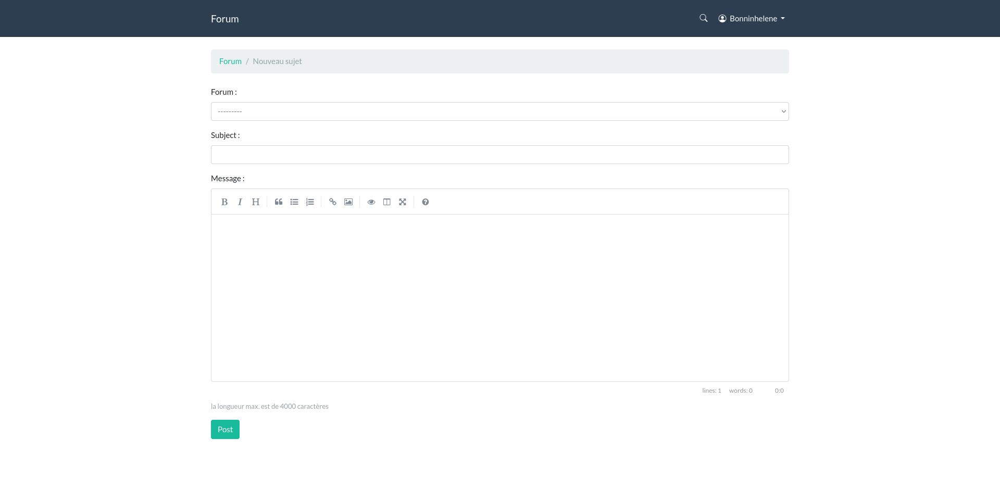

# forum

## install

```
git clone https://github.com/niux3/forum.git
cd forum
mkdir .venv
pipenv shell
pipenv install
./manage.py migrate
./manage.py create_themes
```

if you want populate database

```
./manage.py create_users
./manage.py create_boards
./manage.py create_topics
./manage.py create_posts
```

How to launch application ?

```
./manage.py runserver
```

## screenshots





